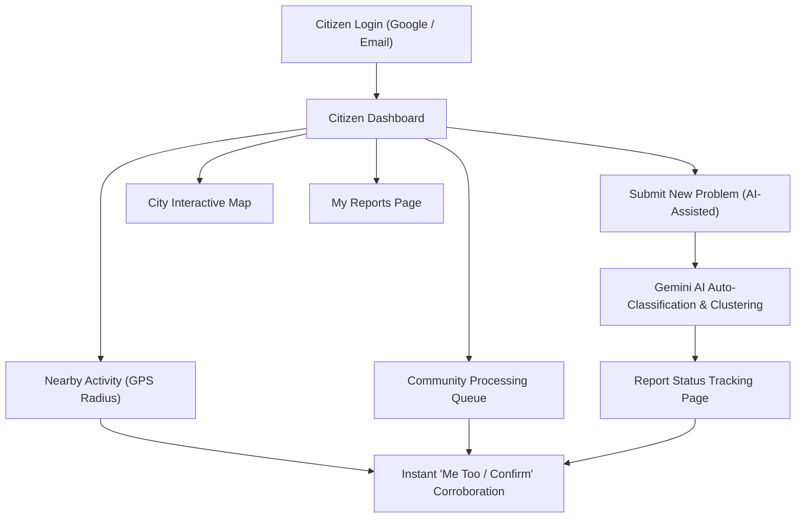

# UrbanMend (নগর সেবা) - Municipal Civic Issue Platform

> **UrbanMend** is an AI-powered municipal civic reporting, automated triage, and community corroboration platform designed for urban governance (Dhaka Metropolitan Area). It bridges the gap between citizens, municipal service authorities, and city administrators.

---

## 📑 Table of Contents
1. [Platform Architecture & User Roles](#platform-architecture--user-roles)
2. [Citizen Portal — Features & Functions Overview](#citizen-portal--features--functions-overview)
   - [1. Authentication & Profile Management](#1-authentication--profile-management)
   - [2. Citizen Dashboard](#2-citizen-dashboard)
   - [3. Problem Reporting Wizard & AI Triage](#3-problem-reporting-wizard--ai-triage)
   - [4. Real-Time Report Tracking & Details](#4-real-time-report-tracking--details)
   - [5. Community Processing Queue](#5-community-processing-queue)
   - [6. Citizen Interactive Map](#6-citizen-interactive-map)
   - [7. My Reports Portal](#7-my-reports-portal)
3. [Authority Portal — Blueprint & Features](#authority-portal--blueprint--features)
4. [Admin Portal — Blueprint & Features](#admin-portal--blueprint--features)
5. [Technical Stack & Real-Time Sync Engine](#technical-stack--real-time-sync-engine)
6. [Future Expansion Roadmap](#future-expansion-roadmap)

---

## 👥 Platform Architecture & User Roles

UrbanMend is divided into three distinct, role-gated portals:

| Role | Access Level | Primary Objectives |
| :--- | :--- | :--- |
| **Citizen (নাগরিক)** | Public / Verified Citizen | Report civic hazards, corroborate ("Me Too") neighborhood issues, track resolution live on timeline & map. |
| **Authority (কর্তৃপক্ষ)** | Municipal Workers & Engineers | Inspect assigned department issues, adjust severity/status, dispatch crews, add internal notes, and mark resolved. |
| **Admin (প্রশাসক)** | City Super-Administrators | System-wide analytics, provision authority accounts, moderate reports, review audit logs, and configure AI clustering. |

---

## 🏛️ Citizen Portal — Features & Functions Overview

The **Citizen Portal** is tailored for fast, intuitive, and mobile-friendly community reporting with instant feedback. Below is a full breakdown of all functions and features available to citizens:

---

### 1. Authentication & Profile Management

* **Firebase & Google OAuth Integration:**
  * One-click login with Google account (`GoogleAuthProvider`).
  * Email and Password login/registration fallback.
* **Live Profile Synchronization:**
  * Citizen's real Google display name and high-resolution profile photo are extracted and persisted in `localStorage` and `AuthContext`.
* **Animated Profile Dropdown Menu (`UserMenu.jsx`):**
  * Displays user avatar, verified Google badge, full name, email, and active role.
  * Smooth cubic-bezier opening and closing animation (`transition: 0.75s` with `0.3s` delay).
* **Citizen Settings Page (`/citizen/settings`):**
  * Displays profile avatar card with Google verification indicator.
  * Account details, preferred language switcher, notification toggles, and secure logout.

---

### 2. Citizen Dashboard (`/citizen/dashboard`)

* **Real-time KPI Metric Counters:**
  * **Processing:** Active civic cases currently under investigation or work.
  * **High Priority:** Urgent incidents requiring immediate municipal response.
  * **Resolved:** Total civic problems successfully repaired and closed this month.
* **GPS-Powered "Nearby Activity" Feed:**
  * Automatically detects citizen's GPS coordinates via browser geolocation.
  * Calculates exact distance using the **Haversine formula**.
  * Dynamic radius filtering: Displays issues within 1 km or 5 km of the citizen's location.
* **Community Issue Cards (`CommunityIssueCard.jsx`):**
  * Photo evidence thumbnail with fallback categories.
  * Category badge (Roads, Water & Drainage, Electrical, etc.).
  * Severity indicators (**Critical**, **High**, **Medium**, **Low**).
  * Resolution status pill (Submitted, Under Review, Dispatched, In Progress, Solved).
  * Distance pill (e.g., `350 m away`, `1.2 km away`).
  * Bundled report indicator (shows when multiple citizen complaints are merged into one cluster).
* **Instant "Me Too / Confirm" Button:**
  * Allows citizens to corroborate a problem with zero delay (0ms optimistic cache update).
  * Immediately updates the affected citizen count on both the button and card text.
* **Quick Navigation:**
  * One-click "Report a Problem" modal launcher.
  * "Track" button on each card for deep-dive status inspection.

---

### 3. Problem Reporting Wizard & AI Triage (`/citizen/reports/new`)

* **Multi-Step Guided Flow (`ReportWizardPage.jsx` / `ReportSubmitModal.jsx`):**
  * Step 1: Upload photo evidence.
  * Step 2: Set exact location on map or use device GPS.
  * Step 3: Select category & write description.
  * Step 4: Review AI assessment and submit.
* **Photo Upload & EXIF Privacy Sanitization:**
  * Accepts camera capture and file uploads (JPEG/PNG/WebP).
  * Client-side metadata stripping prevents leaking sensitive citizen device EXIF information.
* **Interactive Map Pinning:**
  * Integrated Dhaka city boundary polygon verification.
  * Draggable pin marker with reverse-geocoded road and area names.
* **Google Gemini AI Automated Triage:**
  * Multi-modal AI analyzes the uploaded photo and text description.
  * Assigns category, severity signal, and confidence score.
  * Generates an engineering rationale explaining why the issue is critical or moderate.
  * Built-in keyword fallback classifier in case of network disruptions.
* **Instant Redirection:** Automatically navigates to the tracking page upon submission.

---

### 4. Real-Time Report Tracking & Details (`/citizen/reports/:reportId`)

* **0ms Instant Cache Loading:**
  * Pre-loaded from React Query cache: Displays issue title, photo, location, and corroboration count with zero skeleton loading delay.
* **4-Stage Visual Status Timeline (`StatusTimeline.jsx`):**
  1. **Report Submitted:** Timestamp of submission.
  2. **AI Classification:** AI model assessment, confidence percentage, and triage rationale.
  3. **Assigned to Authority:** Department dispatch status and assigned official handle.
  4. **Issue Resolution:** Completion timestamp and post-repair verification.
* **Dual "Me Too / Confirm" Action Buttons:**
  * One in the top sticky action bar.
  * One in the highlighted community callout box ("Does this problem affect your area too?").
  * Both buttons stay synchronized with live citizen corroboration counts.
* **Evidence Photo Gallery (`ReportMediaGallery.jsx`):**
  * High-resolution viewer with "Verified Photo" badge.
* **Interactive Map Panel (`MapPanel.jsx`):**
  * Displays pinpoint GPS marker, latitude/longitude, and street address.
* **Author Edit Modal (`EditReportModal.jsx`):**
  * Allows the reporting citizen to edit description or add details until an authority officially locks/acknowledges the case.
* **Resolution Success Banner:**
  * Displays emerald verification banner when the issue is marked solved by municipal teams.

---

### 5. Community Processing Queue (`/citizen/processing-queue`)

* **Comprehensive Civic Incident Feed:**
  * View all public civic problems reported across the city.
* **Live Aggregate Summary Bar:**
  * Shows total active issues and total affected citizens count across the entire sector.
* **Multi-Dimensional Filters:**
  * **Search:** Free-text keyword search across titles, descriptions, and locations.
  * **Category Filter:** Filter by Roads, Water & Drainage, Waste Management, Streetlights, Parks, etc.
  * **Severity Filter:** Critical, High, Medium, Low.
  * **Status Filter:** Submitted, Under Review, Dispatched, In Progress.
  * **"My Reports Only" Switch:** Quickly isolate your own submitted issues.
* **Intelligent Sorting Options:**
  * **Nearest First (GPS):** Sorts by physical proximity to citizen.
  * **Most Reports / Corroborations:** Highlights hotspots affecting the most people.
  * **Newest First:** Recent incident stream.
  * **Oldest First:** Identifies aging unaddressed problems.
* **Direct Actions:**
  * Corroborate ("Me Too") and Track directly from any queue item.

---

### 6. Citizen Interactive Map (`/citizen/map`)

* **Interactive Fullscreen Map (`CitizenMapPage.jsx`):**
  * Powered by Leaflet / MapLibre with OpenStreetMap tiles.
  * Outlines Dhaka city ward boundaries and operational zones.
* **Dynamic Viewport Clustering:**
  * Fetches GeoJSON clusters and markers based on the current map bounding box (`bbox`) and zoom level.
* **Severity-Coded Markers:**
  * Red (Critical), Orange (High), Amber (Medium), Gray (Low).
* **Interactive Marker Popups:**
  * Displays photo thumbnail, category, street address, citizen corroboration count, and one-click "Track" button.
* **Floating Filter Controls:**
  * Filter map markers by category, severity, and status in real-time.

---

### 7. My Reports Portal (`/citizen/reports`)

* **Citizen's Personal Incident History:**
  * Central list of all reports submitted by the authenticated citizen.
* **Status Tabs:**
  * **All Reports:** Complete chronological archive.
  * **Processing:** Active reports currently undergoing review or repair.
  * **Solved:** Past resolved complaints with closure timestamps.
* **Direct Actions:**
  * Edit pending reports.
  * Open live tracking screen.

---

## 🛠️ Authority Portal — Blueprint & Features

*(Designed for municipal field officers, department dispatchers, and engineers)*

* **Authority Dashboard (`/authority/dashboard`):**
  * Department-specific KPIs (e.g., Roads & Highways vs. Water & Sewerage).
  * SLA aging metrics (Overdue, Critical Unassigned, In-Progress).
* **Triage & Work Queue (`/authority/queue`):**
  * Triage incoming citizen complaints.
  * Sort by severity, age, and corroboration count.
  * Batch assign to field units.
* **Issue Detail & Management (`/authority/issues/:issueId`):**
  * **Status Lifecycle Management:** Move issue through `Acknowledged` ➔ `In Progress` ➔ `Resolved` ➔ `Closed` ➔ `Rejected`.
  * **Severity Override:** Manually override AI-assigned severity with mandatory reason/rationale.
  * **Clustering & Merging:** Merge duplicate citizen reports into one primary issue or split misclassified reports.
  * **Comments & Work Logs:** Add internal staff notes or public updates visible to citizens.
* **Authority Interactive Map (`/authority/map`):**
  * Sector-wide incident heatmaps and crew dispatch routing.
* **Authority Settings (`/authority/settings`):**
  * Department profile, operational ward assignments, and duty notifications.

---

## 🛡️ Admin Portal — Blueprint & Features

*(Designed for city commissioners, department heads, and platform super-administrators)*

* **Admin Dashboard (`/admin/dashboard`):**
  * City-wide high-level operational intelligence and performance analytics.
  * Resolution time averages per department, citizen satisfaction trends.
* **Authority Account Provisioning (`/admin/authorities/provision`):**
  * Create, invite, and provision municipal authority officers.
  * Assign jurisdiction wards, department types, and permission roles.
* **Authority Directory (`/admin/authorities` & `/admin/authorities/:authorityId`):**
  * Manage active municipal worker accounts, monitor case completion rates.
* **Moderation Queue (`/admin/moderation`):**
  * Review flagged, inappropriate, or spam citizen submissions.
  * Soft-delete, hide, or ban malicious accounts.
* **System Audit Logs (`/admin/audit-logs`):**
  * Immutable event stream tracking every status change, severity override, merge, and login event.
* **Admin Map & City Boundary Configuration (`/admin/map`):**
  * Upload and modify GeoJSON boundary polygons for city zones.

---

## ⚙️ Technical Stack & Real-Time Sync Engine

### Frontend Architecture
* **Framework:** React 18 with Vite.
* **State & Caching:** TanStack React Query (`@tanstack/react-query`).
  * **Optimistic UI Engine:** Mutations (`useConfirmIssue`, `useWithdrawConfirmation`) instantly update query caches for `['issues']`, `['reports']`, and `['map-issues']` before the network request finishes.
  * **Automatic Rollback:** Reverts seamlessly if a network error occurs.
* **Styling & Icons:** Tailwind CSS with custom theme variables, Lucide React icons.
* **Maps & Geo:** Leaflet, React-Leaflet, OpenStreetMap, MapLibre.
* **Auth:** Firebase Authentication SDK (Google Auth & Email) with role-gated routing.

### Backend Architecture
* **Framework:** Python 3.12, Django 5.x, Django REST Framework (DRF).
* **Database & GIS:** PostgreSQL 16 with PostGIS extension for spatial queries.
* **Async Workers & Queue:** Celery with Redis for background tasks, clustering calculations, and EXIF processing.
* **AI Engine:** Google Gemini API for multimodal image understanding and automated triage.

---

## 🚀 Future Expansion Roadmap

1. **Bilingual Toggle (বাংলা / English):**
   * Dedicated internationalization (i18n) layer for citizen-friendly Bengali and English UI switching.
2. **Push Notifications & SMS Alerts:**
   * Automated SMS/Web-Push notifications to citizens when their reported issue changes status.
3. **Citizen Karma & Community Leaderboard:**
   * Gamification badges for civic-minded citizens who help corroborate and report neighborhood hazards.
4. **Offline PWA Support:**
   * Allow citizens to snap photos and queue reports while offline, automatically uploading when network reconnects.

---
*Maintained by the UrbanMend Engineering Team.*
