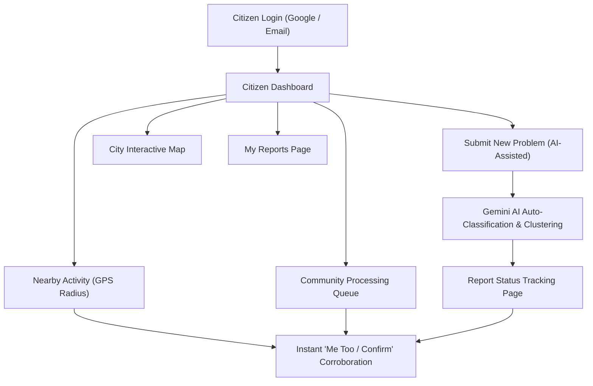
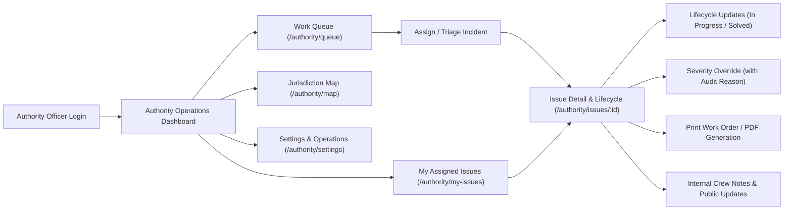
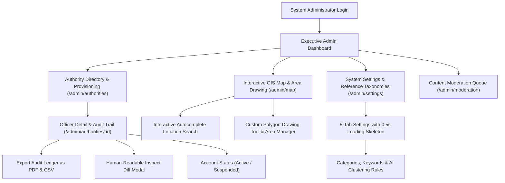

# UrbanMend (নগর সেবা) - Municipal Civic Issue Platform

> **UrbanMend** is an AI-powered municipal civic reporting, automated triage, and community corroboration platform designed for urban governance (Dhaka Metropolitan Area). It bridges the gap between citizens, municipal service authorities, and city administrators.

---

## 📑 Table of Contents
1. [Platform Architecture & User Roles](#platform-architecture--user-roles)
2. [Citizen Portal — Features & Functions Overview](#citizen-portal--features--functions-overview)
   - [1. Authentication & Profile Management](#1-authentication--profile-management)
   - [2. Citizen Dashboard](#2-citizen-dashboard)
   - [3. Problem Reporting Wizard & AI Triage](#3-problem-reporting-wizard--ai-triage)
   - [4. Real-Time Report Tracking & Details](#4-real-time-report-tracking--details)
   - [5. Community Issues](#5-community-issues)
   - [6. Citizen Interactive Map](#6-citizen-interactive-map)
   - [7. My Reports Portal](#7-my-reports-portal)
   - [8. Citizen Settings & Profile Management](#8-citizen-settings--profile-management)
3. [Authority Portal — Features & Operations Workflow](#authority-portal--features--operations-workflow)
   - [1. Executive Operations Dashboard](#1-executive-operations-dashboard)
   - [2. Department Work Queue & Triage Engine](#2-department-work-queue--triage-engine)
   - [3. "My Issues" Assigned Task Queue](#3-my-issues-assigned-task-queue)
   - [4. Comprehensive Issue Detail & Lifecycle Management](#4-comprehensive-issue-detail--lifecycle-management)
   - [5. Printable Municipal Work Orders (PDF Export)](#5-printable-municipal-work-orders-pdf-export)
   - [6. Zonal GIS Operations Map](#6-zonal-gis-operations-map)
   - [7. Authority Profile & Operations Settings](#7-authority-profile--operations-settings)
4. [Admin Portal — Enterprise Governance & GIS Engine](#admin-portal--enterprise-governance--gis-engine)
   - [1. Executive City Governance Dashboard](#1-executive-city-governance-dashboard)
   - [2. Authority Account Provisioning & Management](#2-authority-account-provisioning--management)
   - [3. Individual Officer Profile, Audit Ledger & PDF Export](#3-individual-officer-profile-audit-ledger--pdf-export)
   - [4. Interactive GIS Map, Autocomplete & Custom Area Drawing Engine](#4-interactive-gis-map-autocomplete--custom-area-drawing-engine)
   - [5. System Settings, Reference Taxonomies & Platform Health](#5-system-settings-reference-taxonomies--platform-health)
   - [6. Civic Content Moderation & Security Queue](#6-civic-content-moderation--security-queue)
   - [7. Universal Full-Viewport Modals & UI Polish](#7-universal-full-viewport-modals--ui-polish)
   - [8. Security & Operational Audit Log](#8-security--operational-audit-log)
5. [Technical Stack & Real-Time Sync Engine](#technical-stack--real-time-sync-engine)
6. [Future Expansion Roadmap](#future-expansion-roadmap)

---

## 👥 Platform Architecture & User Roles

UrbanMend is divided into distinct, role-gated portals with safe-mode guest exploration:

| Role | Access Level | Primary Objectives |
| :--- | :--- | :--- |
| **Citizen (নাগরিক)** | Public / Verified Citizen | Report civic hazards, corroborate ("Me Too") neighborhood issues, track resolution live on timeline & map. |
| **Guest Citizen (অতিথি নাগরিক)** | Public / Read-Only | Explore nearby civic activity, browse community issues feed, and view GIS map without registration or account creation. |
| **Authority (কর্তৃপক্ষ)** | Municipal Workers & Engineers | Inspect assigned department issues, track SLA deadlines, dispatch crews, add internal notes, and mark resolved. |
| **Admin (প্রশাসক)** | City Super-Administrators | System-wide analytics, provision authority accounts, monitor unnatural bulk actions, review security audit logs, and configure AI clustering. |

---

## 🏛️ Citizen Portal — Features & Functions Overview

The **Citizen Portal** is tailored for fast, intuitive, and mobile-friendly community reporting with instant feedback. Below is a full breakdown of all functions and features available to citizens:

```mermaid
flowchart TD
    A["Citizen Login (Google / Email)"] --> B["Citizen Dashboard"]
    B --> C["Submit New Problem (AI-Assisted)"]
    B --> D["Nearby Activity (GPS Radius)"]
    B --> E["Community Processing Queue"]
    B --> F["City Interactive Map"]
    B --> G["My Reports Page"]
    
    C --> H["Gemini AI Auto-Classification & Clustering"]
    H --> I["Report Status Tracking Page"]
    D --> J["Instant 'Me Too / Confirm' Corroboration"]
    E --> J
    I --> J
```

---

### 1. Authentication & Profile Management

* **Firebase & Google OAuth Integration:**
  * One-click login with Google account (`GoogleAuthProvider`).
  * Email and Password login/registration fallback.
* **Guest Citizen Exploration ("Login as a Guest / অতিথি প্রবেশ"):**
  * One-click frictionless access for citizens to browse the platform without registering or providing credentials.
  * Allows full exploration of the **Citizen Dashboard**, **GPS Nearby Activity**, **Community Issues Feed**, and **Interactive GIS Map**.
  * **Safe-Mode Read-Only Protection:** Disables destructive and write operations (submitting reports, editing tickets, corroborating issues) with an intuitive modal invitation to log in or register when write actions are initiated.
* **Live Profile Synchronization:**
  * Citizen's real Google display name and high-resolution profile photo are extracted and persisted in `localStorage` and `AuthContext`.
* **Animated Profile Dropdown Menu (`UserMenu.jsx`):**
  * Displays user avatar, verified Google badge, full name, email, and active role.
  * Smooth cubic-bezier opening and closing animation (`transition: 0.75s` with `0.3s` delay).
* **Citizen Settings Page (`/citizen/settings`):**
  * Displays profile avatar card with Google verification indicator.
  * Account details, preferred language switcher, notification toggles, and secure logout.

---

### 2. Citizen Dashboard (`/citizen/dashboard`)

* **Real-time KPI Metric Counters:**
  * **Processing:** Active civic cases currently under investigation or work.
  * **High Priority:** Urgent incidents requiring immediate municipal response.
  * **Resolved:** Total civic problems successfully repaired and closed this month.
* **GPS-Powered "Nearby Activity" Feed:**
  * Automatically detects citizen's GPS coordinates via browser geolocation.
  * Calculates exact distance using the **Haversine formula**.
  * Dynamic radius filtering: Displays issues within 1 km or 5 km of the citizen's location.
* **Community Issue Cards (`CommunityIssueCard.jsx`):**
  * Photo evidence thumbnail with fallback categories.
  * Category badge (Roads, Water & Drainage, Electrical, etc.).
  * Severity indicators (**Critical**, **High**, **Medium**, **Low**).
  * Resolution status pill (Submitted, Under Review, Dispatched, In Progress, Solved).
  * Distance pill (e.g., `350 m away`, `1.2 km away`).
  * Bundled report indicator (shows when multiple citizen complaints are merged into one cluster).
* **Instant "Me Too / Confirm" Button:**
  * Allows citizens to corroborate a problem with zero delay (0ms optimistic cache update).
  * Immediately updates the affected citizen count on both the button and card text.
* **Quick Navigation:**
  * One-click "Report a Problem" modal launcher.
  * "Track" button on each card for deep-dive status inspection.

---

### 3. Problem Reporting Wizard & AI Triage (`/citizen/reports/new`)

* **Multi-Step Guided Flow (`ReportWizardPage.jsx` / `ReportSubmitModal.jsx`):**
  * Step 1: Upload photo evidence.
  * Step 2: Set exact location on map or use device GPS.
  * Step 3: Select category & write description.
  * Step 4: Review AI assessment and submit.
* **Photo Upload & EXIF Privacy Sanitization:**
  * Accepts camera capture and file uploads (JPEG/PNG/WebP).
  * Client-side metadata stripping prevents leaking sensitive citizen device EXIF information.
* **Interactive Map Pinning:**
  * Integrated Dhaka city boundary polygon verification.
  * Draggable pin marker with reverse-geocoded road and area names.
* **Google Gemini AI Automated Triage:**
  * Multi-modal AI analyzes the uploaded photo and text description.
  * Assigns category, severity signal, and confidence score.
  * Generates an engineering rationale explaining why the issue is critical or moderate.
  * Built-in keyword fallback classifier in case of network disruptions.
* **AI Proximity Duplicate Detection Engine (Within 50 Meters):**
  * Real-time spatial scanning powered by the **Haversine Distance Formula** checking for active civic issues within a **50-meter radius** matching the selected category.
  * Triggers an interactive **Duplicate Notice Modal (`DuplicatePromptModal`)** before final submission:
    * Informs citizen: *"This type of issue was already submitted nearby. Is your report for this same existing issue, or a new issue?"*
    * Shows nearby incident thumbnail photo, category, title, exact distance (e.g. `42m away`), and current affected citizen count.
    * **Same Issue Confirmation:** If the citizen clicks *"Yes, Same Issue (+1 Affected)"*, the platform invokes `POST /issues/{id}/confirmations` to increment the **affected citizen count (+1)** on the existing ticket without creating ticket clutter, immediately showing a successful confirmation screen.
    * **New Issue Confirmation:** If the citizen clicks *"No, Submit as New Issue"*, the system proceeds with creating a distinct, new municipal ticket.
* **Instant Redirection:** Automatically navigates to the tracking page upon submission.

---

### 4. Real-Time Report Tracking & Details (`/citizen/reports/:reportId`)

* **0ms Instant Cache Loading:**
  * Pre-loaded from React Query cache: Displays issue title, photo, location, and corroboration count with zero skeleton loading delay.
* **4-Stage Visual Status Timeline (`StatusTimeline.jsx`):**
  1. **Report Submitted:** Timestamp of submission.
  2. **AI Classification:** AI model assessment, confidence percentage, and triage rationale.
  3. **Assigned to Authority:** Department dispatch status and assigned official handle.
  4. **Issue Resolution:** Completion timestamp and post-repair verification.
* **Dual "Me Too / Confirm" Action Buttons:**
  * One in the top sticky action bar.
  * One in the highlighted community callout box ("Does this problem affect your area too?").
  * Both buttons stay synchronized with live citizen corroboration counts.
* **Evidence Photo Gallery (`ReportMediaGallery.jsx`):**
  * High-resolution viewer with "Verified Photo" badge.
* **Interactive Map Panel (`MapPanel.jsx`):**
  * Displays pinpoint GPS marker, latitude/longitude, and street address.
* **Author Edit Modal (`EditReportModal.jsx`):**
  * Allows the reporting citizen to edit description or add details until an authority officially locks/acknowledges the case.
* **Resolution Success Banner:**
  * Displays emerald verification banner when the issue is marked solved by municipal teams.

---

### 5. Community Issues (`/citizen/queue`)

* **Comprehensive Civic Incident Feed (formerly Processing Queue):**
  * Live feed of active civic issues and municipal operations currently being resolved across your area.
* **Live Aggregate Summary Bar:**
  * Shows total active issues and total affected citizens count across the entire sector.
* **Multi-Dimensional Filters:**
  * **Search:** Free-text keyword search across titles, descriptions, and locations.
  * **Category Filter:** Filter by Roads, Water & Drainage, Waste Management, Streetlights, Parks, etc.
  * **Severity Filter:** Critical, High, Medium, Low.
  * **Status Filter:** In Progress, Acknowledged, Under Review.
  * **"My Reports Only" Switch:** Quickly isolate your own submitted issues.
* **Intelligent Proximity Sorting:**
  * **Nearest First (GPS):** Sorts by physical proximity using Haversine calculation.
  * **Most Corroborations:** Highlights hotspots affecting the most community members.
  * **Newest First:** Real-time stream of recent submissions.
  * **Oldest First:** Identifies aging unaddressed problems.
* **Direct Actions:**
  * Instant "Me Too / Confirm" corroboration directly from any issue card.

---

### 6. Citizen Interactive Map (`/citizen/map`)

* **Interactive Fullscreen Map (`CitizenMapPage.jsx`):**
  * Powered by Leaflet / MapLibre with OpenStreetMap tiles.
  * Outlines Dhaka city ward boundaries and operational zones.
* **Dynamic Viewport Clustering:**
  * Fetches GeoJSON clusters and markers based on the current map bounding box (`bbox`) and zoom level.
* **Severity-Coded Markers:**
  * Red (Critical), Orange (High), Amber (Medium), Gray (Low).
* **Interactive Marker Popups:**
  * Displays photo thumbnail, category, street address, citizen corroboration count, and one-click "Track" button.
* **Floating Filter Controls:**
  * Filter map markers by category, severity, and status in real-time.

---

### 7. My Reports Portal (`/citizen/reports`)

* **Citizen's Personal Incident Archive (`MyReportsPage.jsx`):**
  * Central archive of all reports submitted by the authenticated citizen.
* **Dynamic Status Tabs & Live Counts:**
  * **All My Reports:** Complete chronological archive with total submission tally.
  * **Active in Processing:** Complaints currently undergoing investigation, dispatch, or field repair.
  * **Solved & Verified:** Successfully resolved complaints with official closure timestamps.
* **Search & Status Filtering:**
  * Instant search across description, ID, category, or address.
  * Filter dropdown for In Progress, Under Review, Submitted, and Solved statuses.
* **Direct Actions:**
  * Edit pending reports via polished `EditReportModal` (with clear notice banner and responsive action buttons).
  * One-click transition to Community Issues feed or live incident tracking.

---

### 8. Citizen Settings & Profile Management (`/citizen/settings`)

* **Executive Citizen Workspace:**
  * Modern, full-width responsive profile management interface.
* **Custom Profile Photo Upload:**
  * Circular avatar with camera upload badge.
  * Client-side canvas compression (max 800x800, JPEG 85%) for fast, lightweight photo saving.
* **Editable Display Name:**
  * Edit citizen display name with instant state persistence across the app.
* **Civic Impact Metrics:**
  * Dynamically computes total reports submitted and successfully resolved community issues.
* **Preferences & Security:**
  * Preferred language toggle (Bangla / English), email notification preferences, and account management.

---

## 🛠️ Authority Portal — Features & Operations Workflow

The **Authority Portal** is an enterprise-grade operational command center designed for municipal field engineers, zonal inspectors, and department dispatchers across Dhaka city divisions.

```mermaid
flowchart LR
    A["Authority Officer Login"] --> B["Authority Operations Dashboard"]
    B --> C["Work Queue (/authority/queue)"]
    B --> D["My Assigned Issues (/authority/my-issues)"]
    B --> E["Jurisdiction Map (/authority/map)"]
    B --> F["Settings & Operations (/authority/settings)"]
    
    C --> G["Assign / Triage Incident"]
    G --> H["Issue Detail & Lifecycle (/authority/issues/:id)"]
    D --> H
    H --> I["Lifecycle Updates (In Progress / Solved)"]
    H --> J["Severity Override (with Audit Reason)"]
    H --> K["Print Work Order / PDF Generation"]
    H --> L["Internal Crew Notes & Public Updates"]
```

### 1. Executive Operations Dashboard (`/authority/dashboard`)
* **Department-Scoped Real-time KPIs:**
  * **Active Work Queue:** Total unresolved cases within the authority's assigned department and jurisdiction.
  * **High & Critical Alerts:** Urgent public safety hazards requiring immediate response and crew dispatch.
  * **In Progress Work Orders:** Field crews currently deployed and actively working on-site.
  * **Monthly Resolved:** Cumulative volume of verified repairs completed in the current cycle with resolution percentage.
* **Urgent SLA Attention Feed:**
  * Prioritized listing of overdue, aging, or high-impact incidents with direct "Review & Dispatch" actions.
* **Manual Walk-In Entry Modal (`ManualEntryModal.jsx`):**
  * Allows dispatchers to log civic complaints received via walk-in citizen counters, municipal telephone hotlines, or field inspection dispatches directly into the digital triage engine.

### 2. Department Work Queue & Triage Engine (`/authority/queue`)
* **Unified Municipal Incident Stream:**
  * Displays incoming citizen reports, AI-grouped incident clusters, and pending dispatches.
* **Multi-Dimensional Filtering & Faceting:**
  * Filter by category (Roads, Water & Drainage, Waste, Electricity, etc.), severity rating (Critical, High, Medium, Low), operational status, and SLA deadlines.
* **Dynamic Proximity & Hotspot Sorting:**
  * Sort by nearest to officer's current GPS location, highest citizen corroboration count, or oldest pending.
* **Assignment & Dispatch Engine:**
  * Assign issues to specific field officers, maintenance contractors, or self-assign with a single click.
* **Municipal Resolution Deadline & SLA Tracking Engine:**
  * Strict tracking against official municipal resolution service level agreements:
    * **Critical Priority:** 24-Hour resolution deadline.
    * **High Priority:** 72-Hour (3-Day) resolution deadline.
    * **Medium Priority:** 7-Day resolution deadline.
    * **Low Priority:** 14-Day resolution deadline.
  * **Real-Time Dynamic SLA Badges (`SlaBadge.jsx`):** Live countdown indicators (`2d left`, `5h remaining`) and overdue alerts (`🔴 Overdue by 4h`).
  * **SLA Queue Filtering:** Dropdown filter presets for `All Deadlines`, `🔴 Overdue Issues`, `⚠️ Due in <24h`, and `🟢 On Track`.
* **Batch Operations & Unnatural Activity Protection Engine:**
  * Multi-select floating bulk action toolbar for assigning, acknowledging, progressing, resolving, or rejecting multiple issues simultaneously.
  * **Automated Anomaly Detection (`unnaturalActivity.js`):** Flags mass mutations (≥ 5 reports modified concurrently) as unnatural bulk activities.
  * **Progressive Account Restrictions:**
    * **1st Violation:** Triggers a **15-minute temporary cooldown**, disabling dispatch mutations and rendering a live ticking countdown badge (`RestrictionBadge.jsx`).
    * **Repeated Violations:** Enforces a **permanent account suspension** until an Administrator investigates and manually reactivates the account.
    * **Dynamic Auto-Restoration:** The 15-minute cooldown timer ticks down live (`14m 58s` ➔ `0s`) and automatically clears without requiring a page refresh.

### 3. "My Issues" Assigned Task Queue (`/authority/my-issues`)
* **Personalized Officer Work Order Stream:**
  * Dedicated workspace filtering exclusively to issues assigned to the authenticated officer.
* **Live Sidebar Notification Badge:**
  * Real-time numeric badge (`badgeKey: 'myIssues'`) in the navigation sidebar displaying unaddressed assignments.
* **Quick Status Transitioning:**
  * Direct action buttons to advance tasks from Acknowledged to In Progress or Mark as Solved.

### 4. Comprehensive Issue Detail & Lifecycle Management (`/authority/issues/:issueId`)
* **Standard Municipal Lifecycle Transitions:**
  * Official state machine progressing issues through `Acknowledged` ➔ `In Progress` ➔ `Resolved` ➔ `Closed` ➔ `Rejected`.
* **Resolution Deadline & SLA Progress Card:**
  * Prominent card displaying remaining time countdown, visual progress bar, priority benchmark, and target completion timestamp.
* **AI Duplicate & Clustered Reports Inspector:**
  * Automatically scans for active civic issues within 50 meters matching the same category.
  * Displays spatial distance in meters (e.g. `42m away`), corroboration tally, and direct View/Merge action controls.
* **Authoritative Severity Override Engine:**
  * Allows municipal engineers to override AI-assigned severity levels (e.g. escalating Medium to Critical) with mandatory audit reasoning stored in the immutable system ledger.
* **Report Clustering & Duplicate Management:**
  * View all corroborating citizen reports merged into the parent incident cluster, with individual photo evidence, citizen descriptions, and timestamps.
  * Ability to detach or re-cluster misclassified submissions.
* **Dual-Channel Incident Communication:**
  * **Internal Notes:** Confidential operational logs and communication between municipal staff and field crews.
  * **Public Citizen Updates:** Official progress announcements visible to citizens on their live tracking timeline.

### 5. Printable Municipal Work Orders (PDF Export)
* **Official Vector PDF Generator:**
  * Built using `jspdf` and `jspdf-autotable` for pixel-perfect client-side PDF document generation.
  * Includes official municipal header, incident ID, high-precision GPS coordinates, street address, and priority badge.
  * Embedded QR code for field crew instant verification on mobile devices.
  * Structured work order item checklist, assigned crew roster, and official authorization signature blocks.

### 6. Zonal GIS Operations Map (`/authority/map`)
* **Interactive Field Command Map:**
  * Built on Leaflet with OpenStreetMap layers, displaying active incidents across Dhaka city.
  * Severity-coded visual markers and dynamic clusters with real-time popup cards.
* **Ward Boundary & Category Filtering:**
  * Filter visible map incidents by assigned department category, severity, and status.
  * High-density incident clustering with spatial heat indicators.

### 7. Authority Profile & Operations Settings (`/authority/settings`)
* **Executive Two-Column Layout:**
  * High-contrast workspace with persistent left navigation rail and right settings panel.
* **Official Avatar & Department Clearance:**
  * Department identity card featuring the official Municipal Shield insignia and dynamic account status badge (`Active Account` / `Suspended`).
  * Circular avatar with client-side canvas compression (max 800x800, JPEG 85%) for photo uploads.
* **4-Tab Navigation with 0.5s Smooth Loading Transition:**
  * Backed by `TabLoadingSkeleton.jsx` with a stable `min-h-[460px]` container to eliminate layout shift and scroll jump when switching tabs:
    1. **Profile & Contact Details:** Officer full name, official contact email, telephone/hotline, and preferred UI language.
    2. **Jurisdiction & Mandate Scope:** Assigned city division, category zones (Roads, Drainage, Waste, etc.), and operational clearance parameters.
    3. **Security & 2FA:** Two-Factor Authentication setup, active session monitoring, and password updates.
    4. **Notification Settings:** Live alert toggles, daily incident briefings, and emergency SMS escalation channels.

---

## 🛡️ Admin Portal — Enterprise Governance & GIS Engine

The **Admin Portal** is designed for City Commissioners, Municipal Chief Executives, and Platform Super-Administrators. It provides city-wide operational intelligence, authority personnel provisioning, immutable audit ledgers, content moderation, and custom GIS boundary drawing.

```mermaid
flowchart TD
    A["System Administrator Login"] --> B["Executive Admin Dashboard"]
    B --> C["Authority Directory & Provisioning (/admin/authorities)"]
    B --> D["Interactive GIS Map & Area Drawing (/admin/map)"]
    B --> E["System Settings & Reference Taxonomies (/admin/settings)"]
    B --> F["Content Moderation Queue (/admin/moderation)"]
    
    C --> G["Officer Detail & Audit Trail (/admin/authorities/:id)"]
    G --> H["Export Audit Ledger as PDF & CSV"]
    G --> I["Human-Readable Inspect Diff Modal"]
    G --> J["Account Status (Active / Suspended)"]
    
    D --> K["Interactive Autocomplete Location Search"]
    D --> L["Custom Polygon Drawing Tool & Area Manager"]
    
    E --> M["5-Tab Settings with 0.5s Loading Skeleton"]
    M --> N["Categories, Keywords & AI Clustering Rules"]
```

### 1. Executive City Governance Dashboard (`/admin/dashboard`)
* **City-Wide High-Level Operational Intelligence:**
  * **Active Civic Incidents:** Total open issues across all municipal zones.
  * **SLA Breaches & Critical Alerts:** Urgent cases exceeding mandated response windows.
  * **Departmental Resolution Rate:** City-wide resolution percentage and average repair duration.
  * **Personnel & Community Metrics:** Total active authority officers and registered citizens.
* **Resolution Performance Analytics & Trend Charts:**
  * Interactive charts visualizing incident resolution velocity, weekly intake vs. closed cases, and departmental performance comparisons.
* **Municipal Governance & Audit Log Stream:**
  * Live feed of system events with human-readable action summaries (e.g. *User Account Updated*, *Severity Overridden*, *Issue Clustered*).
  * Role-colored actor badges (`Admin`, `Authority`, `System`), direct links to target entities, and relative timestamps.
* **Quick Dispatch & Shortcuts:**
  * One-click shortcuts to provision authority officers, jump to flagged submissions, or inspect infrastructure health.

### 2. Authority Account Provisioning & Management (`/admin/authorities`)
* **Municipal Authority Directory:**
  * Central personnel registry listing all municipal engineers, inspectors, and departmental staff.
  * Real-time search across names, emails, departments, and assigned wards.
  * Department filter tabs (All, Roads, Waste, Water & Drainage, Electricity, etc.).
  * Dynamic status indicator pills (`Active` / `Suspended`).
* **Dynamic Restriction Indicators & Real-Time Countdown:**
  * Table status column dynamically renders `🔴 Suspended` or `🟠 Cooldown (14m 32s)` with animated pulsing indicators (`RestrictionBadge.jsx`).
  * One-click **"Reactivate"** button in table action column allowing administrators to lift operational cooldowns and suspensions instantly.
* **Authority Provisioning Modal (`AddAuthorityModal.jsx`):**
  * One-click staff onboarding modal rendered via React Portals (`document.body`).
  * Automatic strong password generation with copy-to-clipboard functionality.
  * Department category assignment, jurisdiction ward selection, and operational permission role configuration.

### 3. Individual Officer Profile, Audit Ledger & PDF Export (`/admin/authorities/:authorityId`)
* **Executive Officer Profile Header & Security Alerts:**
  * Displays officer insignia avatar, full name, official department, contact details, assigned ward territory, and dynamic status badge (`Active` / `Suspended` / `Cooldown`).
  * **Security Engine Restriction Banner:** Prominently alerts administrators when an officer is in temporary cooldown or permanently suspended due to unnatural bulk actions, with violation counts, reasons, and a prominent **"Reactivate & Unlock Account"** action button.
  * Performance summary counters: Total Assigned, Total Resolved, In Progress, and Resolution Success Rate.
* **3-Tab Navigation with 0.5s Smooth Loading Transition:**
  * Powered by `TabLoadingSkeleton.jsx` (500ms delay with `min-h-[460px]` container) ensuring buttery-smooth tab transitions without layout shifts:
  * **Tab 1: Assigned Reports & Issues:**
    * Filter tabs: `All Assigned`, `In Progress`, `Acknowledged`, `Resolved / Solved`.
    * Instant search across report titles, incident codes, and addresses.
    * Comprehensive data table displaying issue preview, category badge, severity level, status, submission date, and direct detail links.
  * **Tab 2: Activity Log & Audit Trail:**
    * Chronological immutable ledger of all actions performed by or targeting the officer account.
    * Real-time search across action types, actors, and metadata.
    * **Official Audit Report PDF Export (`exportOfficerAuditPdf`):** Generates a formatted, publication-ready municipal audit report with executive headers, officer metadata, time range, tabular event ledger, actor roles, and cryptographic ledger hash.
    * **Audit CSV Export:** Download raw event streams for compliance auditing and external analysis.
    * **Inspect Diff Modal (`OfficerInspectModalContent`):** User-friendly visual diff viewer converting raw technical JSON records into clean, human-readable field comparisons (e.g. *Status changed from Active to Suspended*, *Scope updated*) with status badges and clean typography.
  * **Tab 3: Account Settings & Scope:**
    * **Account Status Modification:** Toggle between `Active` and `Suspended` with an explicit confirmation dialog explaining operational access implications.
    * **Password Reset Tool:** Securely reset officer passwords directly from the admin console with instant confirmation feedback.
    * **Jurisdiction & Scope Editor:** Reassign geographic wards and toggle category authority checkboxes in real-time.

### 4. Interactive GIS Map, Autocomplete & Custom Area Drawing Engine (`/admin/map`)
* **High-Performance Spatial Command Canvas:**
  * Powered by Leaflet / MapLibre with smooth pan, zoom, and Dhaka administrative zone boundaries.
  * Severity-coded marker clusters with instant inspection popups and direct navigation.
* **Interactive Location Search with Autocomplete & Geo-Focus:**
  * Live search input querying Dhaka roads, prominent landmarks, neighborhoods, and administrative wards.
  * Autocomplete suggestion dropdown with category badges and coordinates.
  * Instant map camera fly-to animation centering directly on the selected location with an animated focus marker.
* **Manual Area Marking & Custom Polygon Drawing Tool:**
  * **Point-by-Point Boundary Drawing:** Click on the map to define custom municipal operational zones, emergency containment perimeters, or infrastructure project boundaries.
  * **Live Perimeter Measurement:** Real-time perimeter calculation (meters/kilometers) and point count tracker.
  * **Dedicated Right-Side Drawer Panel:** Keeps all drawing tools, active coordinates, and area controls neatly organized in a collapsible side drawer without obstructing the map viewport.
  * **Persistent Custom Polygon Storage:** Save drawn zones with custom names, color coding (Primary Teal, Crimson Red, Amber Yellow, Indigo Blue), and operational descriptions into storage.
  * **Area Manager & Deletion:** View all saved custom zones, inspect perimeter metrics, toggle zone visibility on/off, and delete/remove saved custom areas with one click.
  * **Default Layer Optimization:** Municipal ward polygons are hidden by default to provide a clean, distraction-free view, with a floating layer toggle switch to reveal them whenever needed.

### 5. System Settings, Reference Taxonomies & Platform Health (`/admin/settings`)
* **Executive Administrative Hero Profile:**
  * Displays executive seal insignia, full administrator name, fixed system email, national jurisdiction badge, and dynamic status indicator (`Active Account` / `Suspended`).
  * Photo update modal with client-side canvas compression and official seal presets.
* **5-Tab Navigation with 0.5s Smooth Loading Transition:**
  * Integrated with `TabLoadingSkeleton.jsx` (500ms delay, `min-h-[460px]`, `animate-fade-in`):
  * **Tab 1: Profile & Credentials:** Edit administrator display name, contact phone, UI language, and view immutable security email.
  * **Tab 2: Reference Data & Taxonomies:**
    * Manage civic issue categories with bilingual support (English and Bengali labels).
    * Toggle category active/inactive statuses in real-time.
    * Severity keyword dictionary management: add/remove weighted keywords (Critical, High, Medium, Low) for automated NLP triage.
    * AI Clustering Rule configuration: customize spatial clustering radius (meters) and time window thresholds (hours) per category.
  * **Tab 3: Security & 2FA:**
    * Two-Factor Authentication (TOTP) setup modal with QR code scanner and 6-digit verification code.
    * Active session audit and cryptographic credential enforcement.
  * **Tab 4: Infrastructure & Health Telemetry:**
    * Live health telemetry tracking PostgreSQL database latency, Redis cache connectivity, Celery worker status, and API response times.
    * Server uptime and memory allocation monitors.
  * **Tab 5: Notification Channels:**
    * Global administrative alert toggles, daily moderation digest emails, and critical infrastructure escalation channels.

### 6. Civic Content Moderation & Security Queue (`/admin/moderation`)
* **Civic Submission Safety Inspection:**
  * Review citizen reports flagged by AI content filters or community members for inappropriate text, spam, or invalid imagery.
* **Moderation Actions:**
  * Dismiss false flags, soft-delete abusive submissions, or ban/suspend repeat offender accounts with full audit trail logging.

### 7. Universal Full-Viewport Modals & UI Polish
* **React Portal Integration (`Dialog.jsx`):**
  * All application modals are portaled directly to `document.body` with `z-[9999]`, guaranteeing 100% viewport coverage across all resolutions without being clipped by parent overflow containers.
* **Refined Backdrop & Shadows:**
  * Balanced, lightweight backdrop blur and shadow styling providing clean modal elevation without darkening the background too harshly.

### 8. Security & Operational Audit Log (`/admin/audit`)
* **Cryptographically Recorded Operational Ledger:**
  * Comprehensive chronological activity trail recording administrative, dispatch, moderation, and lifecycle decisions.
* **Unnatural Bulk Operations & Anomaly Detection:**
  * **"Unnatural Bulk" KPI Metric Card:** Real-time counter of flagged mass mutation anomalies across all authorities.
  * **"Unnatural Activities (অস্বাভাবিক কার্যকলাপ)" Filter Tab:** Dedicated audit log filter isolating security anomalies and bulk action violations.
  * **Prominent Security Alert Banner:** Alerts city administrators to suspicious or excessive bulk operations.
  * **Inline Account Reactivation:** Directly unlock and restore restricted municipal officers from the audit log entry with one click.

---

## ⚙️ Technical Stack & Real-Time Sync Engine

### Frontend Architecture
* **Framework:** React 18 with Vite.
* **State & Caching:** TanStack React Query (`@tanstack/react-query`).
  * **Optimistic UI Engine:** Mutations (`useConfirmIssue`, `useWithdrawConfirmation`) instantly update query caches for `['issues']`, `['reports']`, and `['map-issues']` before the network request finishes.
  * **Automatic Rollback:** Reverts seamlessly if a network error occurs.
* **Styling & Icons:** Tailwind CSS with custom theme variables, Lucide React icons.
* **Document Generation:** `jspdf` & `jspdf-autotable` for client-side printable work order generation.
* **Maps & Geo:** Leaflet, React-Leaflet, OpenStreetMap, MapLibre.
* **Auth:** Firebase Authentication SDK (Google Auth & Email) with role-gated routing.

### Backend Architecture
* **Framework:** Python 3.12, Django 5.x, Django REST Framework (DRF).
* **Database & GIS:** PostgreSQL 16 with PostGIS extension for spatial queries.
* **Async Workers & Queue:** Celery with Redis for background tasks, clustering calculations, and EXIF processing.
* **AI Engine:** Google Gemini API for multimodal image understanding and automated triage.

---

## 🚀 Future Expansion Roadmap

1. **Bilingual Toggle (বাংলা / English):**
   * Dedicated internationalization (i18n) layer for citizen-friendly Bengali and English UI switching.
2. **Push Notifications & SMS Alerts:**
   * Automated SMS/Web-Push notifications to citizens when their reported issue changes status.
3. **Citizen Karma & Community Leaderboard:**
   * Gamification badges for civic-minded citizens who help corroborate and report neighborhood hazards.
4. **Offline PWA Support:**
   * Allow citizens to snap photos and queue reports while offline, automatically uploading when network reconnects.

---
*Maintained by the UrbanMend Engineering Team.*
