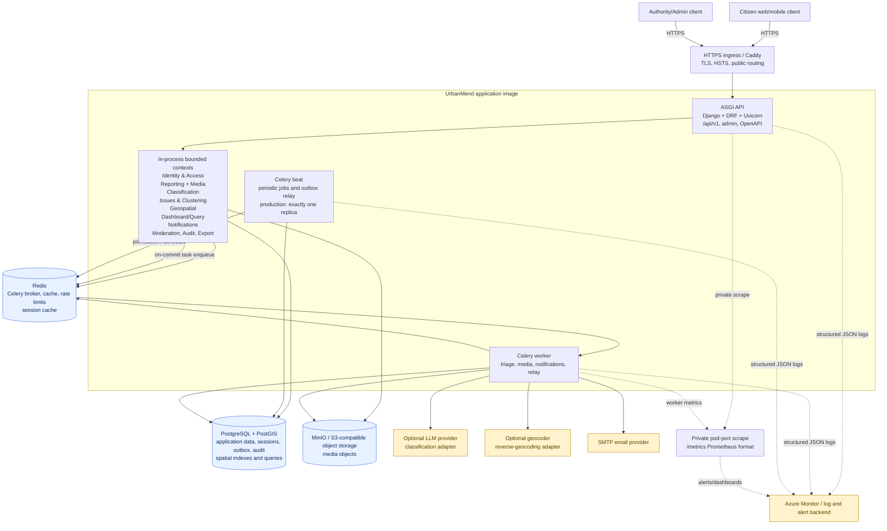

# UrbanMend system design diagram

This diagram describes the system currently implemented in this repository. It distinguishes the
local Docker Compose shape from the production shape documented for Kubernetes/Azure deployment.

## Request and asynchronous processing boundaries

- API requests are authenticated and authorized at the service layer. State-changing work is
  committed to PostgreSQL before Celery tasks are published with `transaction.on_commit`.
- Report triage is asynchronous: classification runs first, using the LLM adapter when available
  and the deterministic keyword fallback when it is unavailable or over a cost/rate limit; issue
  clustering and proximity context follow.
- Domain events are stored in the PostgreSQL transactional outbox. Celery beat relays pending rows;
  notification consumers are idempotent, so broker redelivery is safe.
- Media processing is asynchronous and stores final objects in S3-compatible storage. The API does
  not use the object store as the source of truth for relational state.
- Trace IDs are bound on API requests, propagated in Celery task headers, and included in structured
  logs and error responses. Query strings are deliberately excluded from logs.

## Runtime topology

### Local Docker Compose

Compose runs `db` (PostgreSQL/PostGIS), `redis`, `storage` (MinIO), `api`, and `worker`. The local
worker uses Celery `-B`, so beat runs in-process for development convenience.

### Production deployment

Production uses the same image with separate workloads: API (ASGI/Uvicorn), worker (Celery), and a
single-replica beat deployment. A SHA-pinned migration Job runs before workload rollout. Ingress
terminates TLS and routes public traffic to the API; `/metrics` is intentionally kept off the public
Ingress and scraped only from the pod port.
